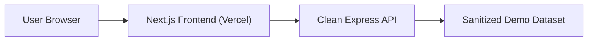

# Warehouse Management App


Warehouse Management App is a portfolio inventory operations interface for small-team warehouse workflows.

It is designed as a practical portfolio project that demonstrates:
- full-stack product thinking
- authentication and role-based access
- API-driven frontend architecture
- warehouse domain modeling
- inventory movement and stock visibility workflows
- clear dashboards for operational reporting

## Live Demo

- Frontend: [project-ytm78.vercel.app](https://project-ytm78.vercel.app)

The public backend is being replaced with a clean-room API that uses sanitized demonstration data only. Until that redeployment is complete, treat this repository as the frontend showcase.

## What The App Does

- user registration and login
- admin and user roles
- warehouse list and warehouse detail views
- product catalog view
- stock visibility by warehouse
- movement history for inbound, outbound, transfer, and adjustment flows
- operational dashboard for warehouse activity

## Highlights

- responsive warehouse operations UI
- warehouse, stock, movement, and product views connected through reusable API services
- admin and user role model with protected routes
- dashboard widgets for stock health, movement mix, recent activity, and user activity
- portfolio-ready example of business workflow modeling for inventory operations

## Screens Included

- `Overview`
- `Warehouses`
- `Warehouse Details`
- `Movements`
- `Products`
- `Stock`
- `Users` (admin access)

## Tech Stack

### Frontend
- Next.js
- TypeScript
- Tailwind CSS
- Axios
- React Context for auth state

### Backend
- Node.js
- Express
- TypeScript
- JWT authentication
- sanitized demo data

### Hosting
- Vercel for frontend
- clean backend deployment pending

## Architecture



## Main Warehouse Domain Model

- `warehouses`
- `products`
- `stock`
- `movements`
- `users`

## Security Work Completed

- bcrypt password hashing
- JWT-based authentication
- protected API routes
- production CORS fix for live frontend
- production-disabled admin bootstrap route
- rate limiting on auth endpoints
- required JWT secret in production

## Local Development

```bash
npm install
npm run dev
```

Set the frontend environment variable:

```bash
NEXT_PUBLIC_API_URL=http://localhost:3000
```

## Related Repository

Clean backend source will be published from the fresh `Warehouse-Backend-Clean` project after deployment.

## Why This Project Matters

This project shows the ability to:
- translate operational requirements into a usable dashboard workflow
- structure frontend code around reusable services, hooks, and UI components
- present inventory, stock, and movement data in a way operators can scan quickly
- separate portfolio-safe demo data from non-public workplace examples

## Current Status

The frontend is live. The backend is being replaced with a clean-room service before public linking.

Current focus areas for future improvement:
- stronger session security with HttpOnly cookies
- warehouse creation/edit workflows polish
- richer stock adjustment and movement creation UI
- reporting and analytics expansion

## Author

Built by [OMBHARTIYA](https://github.com/OMBHARTIYA)
