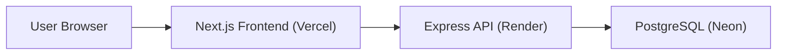

# Warehouse Management App


Warehouse Management App is a live full-stack inventory operations project built from an earlier task manager foundation and refactored into a warehouse workflow system for small teams.

It is designed as a practical portfolio project that demonstrates:
- full-stack product thinking
- authentication and role-based access
- cloud deployment on free-tier infrastructure
- warehouse domain modeling
- inventory movement and stock visibility workflows

## Live Demo

- Frontend: [project-ytm78.vercel.app](https://project-ytm78.vercel.app)
- Backend API: [warehouse-backend-n8ds.onrender.com](https://warehouse-backend-n8ds.onrender.com)
- API docs: [warehouse-backend-n8ds.onrender.com/api-docs](https://warehouse-backend-n8ds.onrender.com/api-docs)

## What The App Does

- user registration and login
- admin and user roles
- warehouse list and warehouse detail views
- product catalog view
- stock visibility by warehouse
- movement history for inbound, outbound, transfer, and adjustment flows
- operational dashboard for warehouse activity

## Highlights

- live cloud deployment with separate frontend and backend services
- warehouse, stock, movement, and product views connected to a real Postgres backend
- admin and user role model with protected routes
- production auth hardening and rate-limited login endpoints
- portfolio-ready example of transforming an existing codebase into a different business domain

## Screens Included

- `Overview`
- `Warehouses`
- `Warehouse Details`
- `Movements`
- `Products`
- `Stock`
- `Users` (admin access)

## Tech Stack

### Frontend
- Next.js
- TypeScript
- Tailwind CSS
- Axios
- React Context for auth state

### Backend
- Node.js
- Express
- TypeScript
- PostgreSQL
- JWT authentication

### Hosting
- Vercel for frontend
- Render for backend
- Neon Postgres for database

## Architecture



## Main Warehouse Domain Model

- `warehouses`
- `products`
- `stock`
- `movements`
- `users`

The original task-manager entities were reworked into warehouse operations:
- `projects` evolved into warehouse-facing management screens
- `tasks` evolved into movement-facing operational flows

## Security Work Completed

- bcrypt password hashing
- JWT-based authentication
- protected API routes
- production CORS fix for live frontend
- production-disabled admin bootstrap route
- rate limiting on auth endpoints
- required JWT secret in production

## Local Development

```bash
npm install
npm run dev
```

Set the frontend environment variable:

```bash
NEXT_PUBLIC_API_URL=http://localhost:3000
```

## Related Repository

Backend source:
- [OMBHARTIYA/Warehouse-Backend](https://github.com/OMBHARTIYA/Warehouse-Backend)

## Why This Project Matters

This project shows the ability to:
- take an existing codebase and reshape it into a different product domain
- deploy a working SaaS-style app on cloud services
- move from local development to live multi-user access
- identify and fix real deployment and security issues during launch

## Current Status

This project is live and usable.

Current focus areas for future improvement:
- stronger session security with HttpOnly cookies
- warehouse creation/edit workflows polish
- richer stock adjustment and movement creation UI
- reporting and analytics expansion

## Author

Built by [OMBHARTIYA](https://github.com/OMBHARTIYA)
