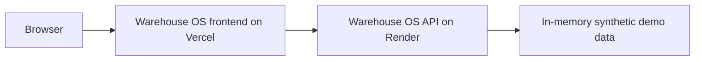

# Warehouse OS

Warehouse OS is a full-stack portfolio application for small-team warehouse and
inventory operations. It uses synthetic demonstration data and is designed to
show practical authentication, role-based access, inventory visibility, and
operational reporting workflows.

## Live application

- Frontend: [warehouse-os-app.vercel.app](https://warehouse-os-app.vercel.app)
- API: [warehouse-backend-n8ds.onrender.com](https://warehouse-backend-n8ds.onrender.com)
- Backend source: [OMBHARTIYA/Warehouse-Backend](https://github.com/OMBHARTIYA/Warehouse-Backend)

The Vercel project is named `warehouse-os` and its production domain is
`warehouse-os-app.vercel.app`. The similarly named `warehouse-os.vercel.app`
domain belongs to a different project and must not be used.

## Features

- registration and JWT-based login
- admin and user roles
- warehouse list, creation, editing, deletion, and detail views
- product catalogue and stock visibility
- inbound, outbound, transfer, and adjustment history
- dashboard summaries for stock health and warehouse activity
- admin-only user management
- responsive light and dark themes

## Technology

- Next.js, React, and TypeScript
- Tailwind CSS
- Axios
- Recharts
- Vercel for the frontend
- Express API hosted on Render

## Architecture



## Run locally

Requirements: a supported Node.js release and the Warehouse OS backend running
locally on port `3000`.

```bash
npm install
```

Create `.env.local`:

```text
NEXT_PUBLIC_API_URL=http://localhost:3000
```

Then start the frontend:

```bash
npm run dev
```

Open `http://localhost:3001`.

## Available commands

```bash
npm run dev
npm run lint
npm run build
npm start
```

## Security and data notes

- The repository contains synthetic demonstration data only. Do not add employer,
  customer, employee, or other confidential records.
- All authorization decisions must be enforced by the backend. Protected frontend
  routes are a user-interface convenience, not a security boundary.
- The current frontend stores its JWT in browser local storage. This is acceptable
  for a portfolio demo using synthetic data, but an application handling sensitive
  data should use secure, HttpOnly, SameSite cookies and CSRF protection.
- Variables prefixed with `NEXT_PUBLIC_` are included in browser code and must
  never contain passwords, tokens, or private keys.
- Demo accounts and their passwords are controlled through private backend
  environment variables and must not be published in this repository.

## Current scope

The backend uses in-memory data, so changes can be lost when the service restarts.
Before using Warehouse OS for real operational data, add a durable database,
HttpOnly cookie sessions, audit logging, backups, account recovery, and a formal
security review.

## Author

Built by [OMBHARTIYA](https://github.com/OMBHARTIYA).
